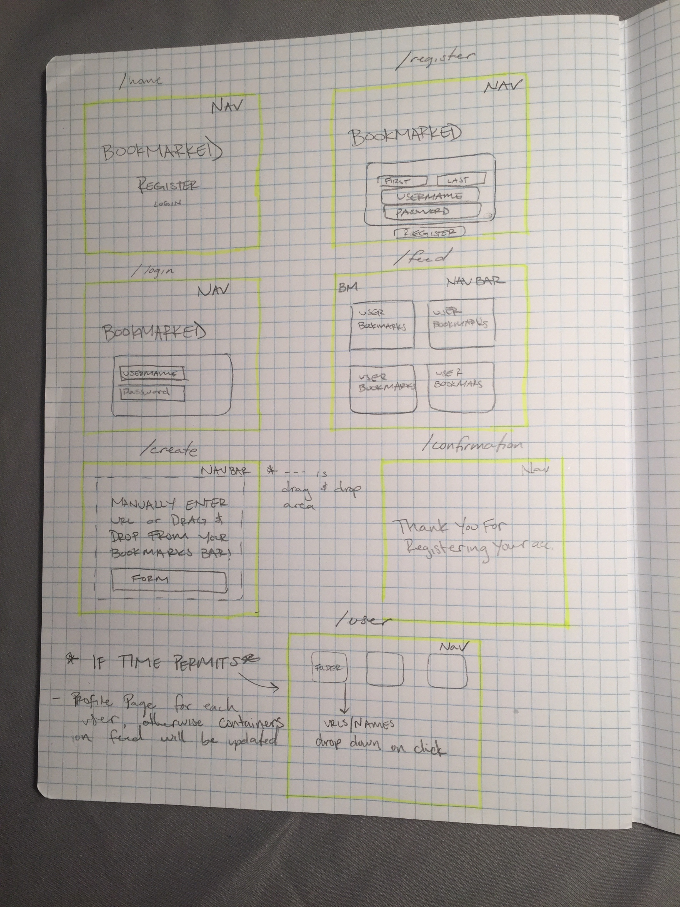
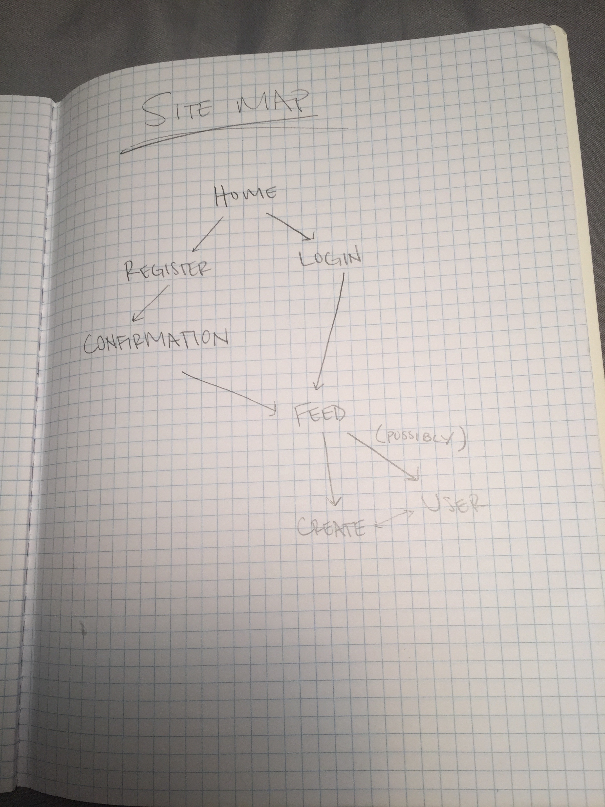

The content below is an example project proposal / requirements document. Replace the text below the lines marked "__TODO__" with details specific to your project. Remove the "TODO" lines.

Longer ToDos:
  - write Schemas in DB.js
  - skeleton express app


# Bookmarked

## Overview

I don't know about you, but I've bookmarked some pretty cool (and strange) things in my day. My bookmarks bar is an amalgamation of learning resources, articles I love and articles I have yet to read, and memes - oh the memes. I know that I've always been curious to see what other people keep in their Bookmarks bar so I'm creating a web application that lets you share and snoop! Once users register their account, they'll have the option to either drag and drop folders directly from their bookmarks bar into the application or manually create single Bookmarks.


## Data Model

The application will store Users, Folders and Items

* users can have multiple folders of bookmarked URLs (via references)
* each folder can have multiple URLS (by embedding)

An Example User:

```javascript
{
  username: "mimi",
  hash: // a password hash,
  lists: // an array of references to List documents
}
```

An Example List with Embedded Items:

```javascript
{
  user: // a reference to username
  name: "WebVR",
  items: [
    { link: "https://webvr.info/developers/", name: "WebVR API", description: ""},
    { name: "https://aframe.io/", name: "A-Frame", description: ""},
  ],
  createdAt: // timestamp
  lastUpdate: // timestamp
}
```


## [Link to Commented First Draft Schema](db.js) (!!!!!!)

## Wireframe



## Site Map


## User Stories or Use Cases

1. as non-registered user, I can register a new account with the site
2. as a user, I can log in to the site
3. as a user, I can create a new 'Bookmark' folder or item
4. as a user, I can drag and drop folders from my Bookmarks bar into my profile
5. as a user, I can manually enter links that I want to bookmark
6. as a user, I can view other users Bookmarks


## Research Topics

* (5 points) [Integrate user authentication](https://www.npmjs.com/package/passport-local)
    * I'm going to be using passport for user authentication
* (3 points) Perform client side form validation using a JavaScript library
    * valid passwords, links, etc
* (4 points) [DataTransfer API](https://developer.mozilla.org/en-US/docs/Web/API/DataTransfer)
    * This API will help me get data from drag and drop objects
* (3 points) [Interact.js](http://interactjs.io/)
    * A library for creating drag and drop events
* (2 points) [Foundation](https://foundation.zurb.com/)
    * Frontend Framework to make application shine!!
* (2 Points) Less framework for CSS
* (1200 points) Learn Graph Theory and Make a Social Network


## [Link to Initial Main Project File](app.js)


## Annotations / References Used

- None yet!
